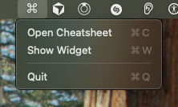
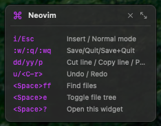
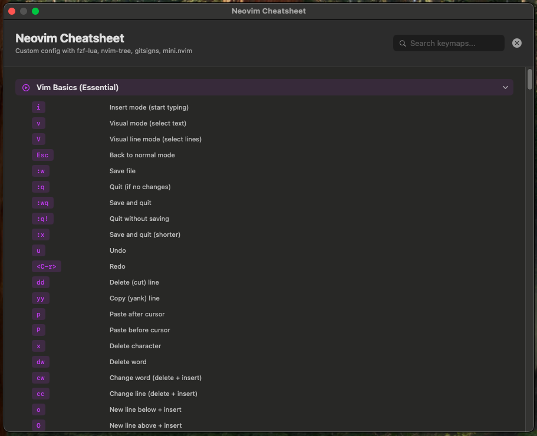
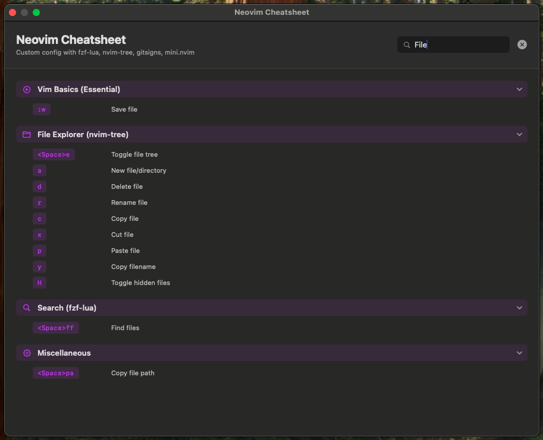

# NvimCheatsheetWidget

A native macOS desktop widget that displays common Neovim shortcuts. Click the widget to expand into a full searchable cheatsheet.

## Screenshots

<p>
  
  
</p>





## Features

- **Compact Widget** - Floats on desktop showing 7 most common shortcuts
- **Expanded Cheatsheet** - Full window with 15 sections of keymaps (including Vim Basics for beginners)
- **Menu Bar Icon** - Quick access from top menu bar (`⌘` icon)
- **Search** - Filter keymaps by keystroke or description
- **Collapsible Sections** - Click headers to expand/collapse
- **Desktop Accessory** - Doesn't show in Dock, stays on all spaces

## Requirements

- macOS 14.0+
- Xcode 15.0+

## Building

```bash
cd /Users/dvz/Luckgrid/Code/Native/NvimCheatsheetWidget
xcodebuild -project NvimCheatsheetWidget.xcodeproj -scheme NvimCheatsheetWidget -configuration Release build
```

The built app will be in:
```
~/Library/Developer/Xcode/DerivedData/NvimCheatsheetWidget-*/Build/Products/Release/NvimCheatsheetWidget.app
```

## Opening in Xcode

```bash
open NvimCheatsheetWidget.xcodeproj
```

## Running

```bash
# Build and run
open ~/Library/Developer/Xcode/DerivedData/NvimCheatsheetWidget-*/Build/Products/Release/NvimCheatsheetWidget.app
```

## Auto-launch with Neovim

Add this to your `~/.config/nvim/init.lua` to open the widget when Neovim starts:

```lua
-- Auto-open NvimCheatsheetWidget on startup
vim.api.nvim_create_autocmd("VimEnter", {
  callback = function()
    local app_path = vim.fn.expand("~/Library/Developer/Xcode/DerivedData/NvimCheatsheetWidget-*/Build/Products/Release/NvimCheatsheetWidget.app")
    local expanded_path = vim.fn.glob(app_path)
    if expanded_path ~= "" then
      vim.fn.jobstart({ "open", expanded_path }, { detach = true })
    end
  end,
})
```

## Neovim Keymap Integration

Add this to your `~/.config/nvim/init.lua` to open/focus the widget with `<Space>?`:

```lua
-- Open NvimCheatsheetWidget if not already running
vim.keymap.set("n", "<leader>?", function()
  local app_path = vim.fn.expand("~/Library/Developer/Xcode/DerivedData/NvimCheatsheetWidget-*/Build/Products/Release/NvimCheatsheetWidget.app")
  local expanded_path = vim.fn.glob(app_path)
  if expanded_path == "" then
    vim.notify("NvimCheatsheetWidget not found. Build it first.", vim.log.levels.WARN)
    return
  end
  -- Open/focus the app
  vim.fn.jobstart({ "open", expanded_path }, { detach = true })
end, { desc = "Open cheatsheet widget" })
```

## Usage

1. The widget appears in the bottom-right corner of your screen
2. Drag the widget to reposition it anywhere on screen
3. Click the close button (X) to hide the widget
4. Click the expand button to open the full cheatsheet
5. Use the search bar to filter keymaps
6. Click section headers to collapse/expand sections
7. Menu bar icon (`⌘`) provides quick access:
   - **Open Cheatsheet** (`⌘C`)
   - **Show Widget** (`⌘W`)
   - **Quit** (`⌘Q`)

## Customizing Keymaps

Edit `NvimCheatsheetWidget/Keymaps.swift` to modify the shortcuts:

- `compactKeymaps` - Array of keymaps shown in the compact widget
- `keymapSections` - Array of sections for the expanded cheatsheet

Each keymap has:
```swift
Keymap(keys: "<Space>ff", description: "Find files")
```

Each section has:
```swift
KeymapSection(title: "Navigation", icon: "arrow.up.arrow.down", keymaps: [...])
```

Icons use SF Symbols names (e.g., `"folder"`, `"magnifyingglass"`, `"terminal"`).

## Customizing Icons

The app uses SF Symbols throughout. You can change icons in two places:

### Menu Bar Icon

Edit `NvimCheatsheetWidgetApp.swift`:

```swift
button.image = NSImage(systemSymbolName: "command", accessibilityDescription: "Neovim Cheatsheet")
```

### Widget Header Icon

Edit `WidgetView.swift`:

```swift
Image(systemName: "command")
```

### Popular SF Symbols for this App

| Symbol | Description |
|--------|-------------|
| `"command"` | ⌘ Command key (current) |
| `"terminal"` | Terminal icon |
| `"terminal.fill"` | Filled terminal |
| `"keyboard"` | Keyboard icon |
| `"book"` | Book outline |
| `"book.fill"` | Filled book |
| `"chevron.left.forwardslash.chevron.right"` | `</>` code brackets |
| `"questionmark.circle"` | Help icon |
| `"doc.text"` | Document with text |

Browse all SF Symbols using Apple's [SF Symbols app](https://developer.apple.com/sf-symbols/).

### Using a Custom Image

To use your own icon image instead of SF Symbols:

1. Add a 16x16 or 18x18 PNG to the project (drag into Xcode)
2. Update the code:

```swift
// Menu bar custom image
if let button = statusItem?.button {
    button.image = NSImage(named: "myCustomIcon")
}

// Widget custom image
Image("myCustomIcon")
    .resizable()
    .frame(width: 16, height: 16)
```

## Project Structure

```
NvimCheatsheetWidget/                    # Root project folder (PascalCase)
├── NvimCheatsheetWidget.xcodeproj/     # Xcode project bundle
│   └── project.pbxproj                 # Project configuration
├── README.md
└── NvimCheatsheetWidget/               # Source group (matches target name)
    ├── NvimCheatsheetWidgetApp.swift   # App entry point & window management
    ├── WidgetView.swift                # Compact widget UI
    ├── CheatsheetView.swift            # Expanded cheatsheet UI
    ├── Keymaps.swift                   # All keymap definitions
    └── Info.plist                      # App configuration
```

### Naming Conventions

This follows Xcode's default structure where the root folder and inner source group share the same name:

| Element | Convention | Example |
|---------|------------|---------|
| Root folder | PascalCase | `NvimCheatsheetWidget/` |
| Xcode project | PascalCase | `NvimCheatsheetWidget.xcodeproj` |
| Source group | PascalCase (matches target) | `NvimCheatsheetWidget/` |
| Swift files | PascalCase | `WidgetView.swift` |
| Bundle ID | reverse-domain.lowercase | `com.luckgrid.NvimCheatsheetWidget` |

The "duplication" of folder names is intentional:
- **Outer folder** - Directory on disk containing the project
- **Inner folder** - Xcode group representing the app target

## Resources

### Swift & SwiftUI

- [Swift Documentation](https://docs.swift.org/) - Official Swift language guide
- [SwiftUI Tutorials](https://developer.apple.com/tutorials/swiftui) - Apple's official SwiftUI tutorials
- [Hacking with Swift](https://www.hackingwithswift.com/) - Free Swift/SwiftUI tutorials
- [Swift by Sundell](https://www.swiftbysundell.com/) - Swift articles and podcasts

### macOS Development

- [macOS App Development](https://developer.apple.com/macos/) - Apple's macOS dev resources
- [AppKit Documentation](https://developer.apple.com/documentation/appkit) - Native macOS UI framework
- [NSWindow Programming Guide](https://developer.apple.com/library/archive/documentation/Cocoa/Conceptual/WinPanel/) - Window management
- [About the macOS App Architecture](https://developer.apple.com/library/archive/documentation/General/Conceptual/MOSXAppProgrammingGuide/AppArchitecture/AppArchitecture.html)

### Widgets & Menu Bar Apps

- [Status Items](https://developer.apple.com/documentation/appkit/nsstatusitem) - Menu bar icons (NSStatusItem)
- [Desktop Accessories](https://developer.apple.com/documentation/appkit/nsapplication/1428621-activationpolicy) - Apps that hide from Dock
- [Floating Windows](https://developer.apple.com/documentation/appkit/nswindow/level) - Window layering

### Design Resources

- [SF Symbols](https://developer.apple.com/sf-symbols/) - Apple's icon library (5,000+ symbols)
- [Human Interface Guidelines](https://developer.apple.com/design/human-interface-guidelines/macos) - macOS design patterns
- [Apple Design Resources](https://developer.apple.com/design/resources/) - Templates and assets

### Tools

- [Xcode](https://developer.apple.com/xcode/) - Apple's IDE
- [SwiftLint](https://github.com/realm/SwiftLint) - Swift style enforcement
- [SWXMLHash](https://github.com/drmohundro/SWXMLHash) - XML parsing (for project files)

## License

MIT
